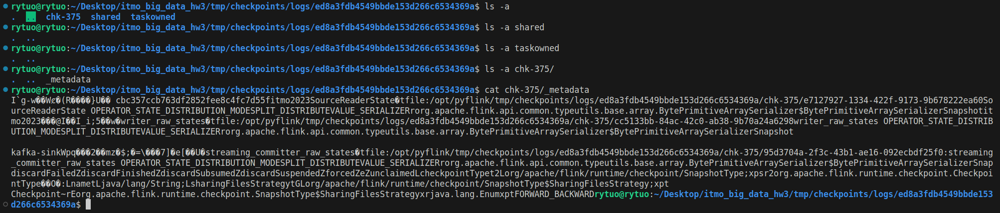
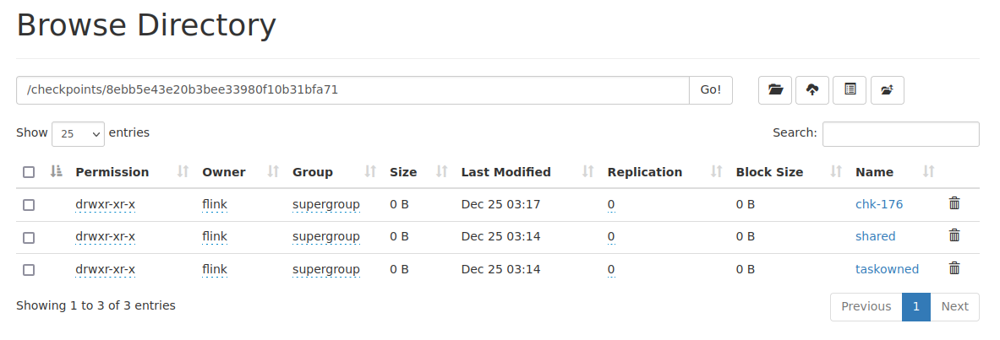
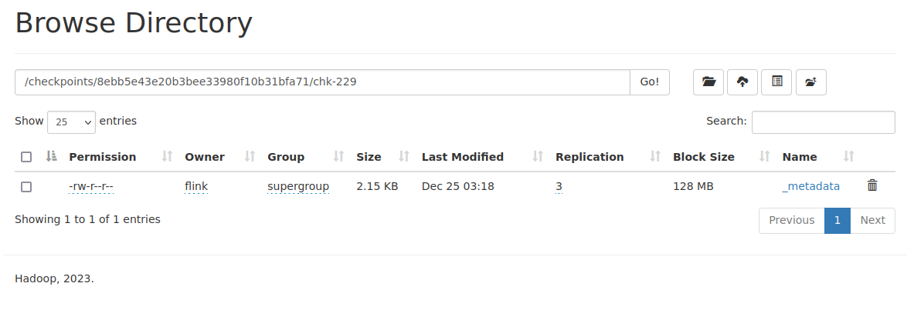
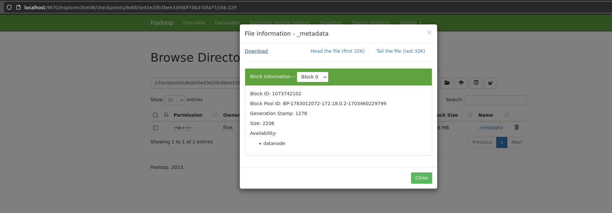

# HW03: Streaming (kafka+flink)

## Troubleshooting
- First namenode run should be with formatting. See comments in [docker-compose.yml](./docker-compose.yml)
- If jobmanager fails with error "cannot run `/opt/pyflink/venv/bin/python` then delete your local `venv`"

### 1. Start service

```
docker compose build

docker compose up -d

mkdir -p tmp/checkpoints/logs/

sudo chmod -R 777 tmp/checkpoints/logs/

docker compose ps
```

Check interface at http://localhost:8081/#/overview

### 2. Create kafka topics

```
docker compose exec kafka kafka-topics.sh --bootstrap-server kafka:9092 --create --topic itmo2023 --partitions 3

docker compose exec kafka kafka-topics.sh --bootstrap-server kafka:9092 --create --topic itmo2023-processed --partitions 3

docker compose exec kafka kafka-topics.sh --bootstrap-server kafka:9092 --create --topic itmo2023-tumbling-max --partitions 3

docker compose exec kafka kafka-topics.sh --bootstrap-server kafka:9092 --create --topic itmo2023-sliding-max --partitions 3

docker compose exec kafka kafka-topics.sh --bootstrap-server kafka:9092 --create --topic itmo2023-session-max --partitions 3
```

### 3. Run scripts (parts are not sequentional)

- Part 1

Choose checkpoint destination in `.env`

```
docker compose exec jobmanager ./bin/flink run -pyfs file:///opt/pyflink -py /opt/pyflink/consumers/itmo_processed_1/itmo2023_processed.py

docker compose exec jobmanager ./bin/flink run -pyfs file:///opt/pyflink -py /opt/pyflink/producers/itmo2023/producer.py

docker compose exec jobmanager ./bin/flink run -pyfs file:///opt/pyflink -py /opt/pyflink/jobs/device.py
```






See [checkpoints configuration](./conf/configure_checkpoints.py)

- Part 2

```
docker compose exec jobmanager ./bin/flink run -pyfs file:///opt/pyflink -py /opt/pyflink/producers/itmo2023/producer.py

# 1
docker compose exec jobmanager ./bin/flink run -pyfs file:///opt/pyflink -py /opt/pyflink/consumers/itmo_processed_1/itmo2023_tumbling_max.py

docker compose exec jobmanager ./bin/flink run -pyfs file:///opt/pyflink -py /opt/pyflink/jobs/tumbling_max.py

# 2
docker compose exec jobmanager ./bin/flink run -pyfs file:///opt/pyflink -py /opt/pyflink/consumers/itmo_processed_1/itmo2023_sliding_max.py -d

docker compose exec jobmanager ./bin/flink run -pyfs file:///opt/pyflink -py /opt/pyflink/jobs/sliding_max.py -d

# 3
docker compose exec jobmanager ./bin/flink run -pyfs file:///opt/pyflink -py /opt/pyflink/consumers/itmo_processed_1/itmo2023_session_max.py -d

docker compose exec jobmanager ./bin/flink run -pyfs file:///opt/pyflink -py /opt/pyflink/jobs/session_max.py -d
```

See implementations [tumbling](./jobs/tumbling_max.py), [sliding](./jobs/sliding_max.py), [session](./jobs/session_max.py)

- Part 3

```
docker compose exec jobmanager ./bin/flink run -pyfs file:///opt/pyflink -py /opt/pyflink/producers/itmo2023/producer.py -d

docker compose exec jobmanager ./bin/flink run -pyfs file:///opt/pyflink -py /opt/pyflink/consumers/itmo_1/itmo2023_failing.py -d
```

See [backoff implementation](./utils/backoff.py) and [usage](./consumers/itmo_1/itmo2023_failing.py)